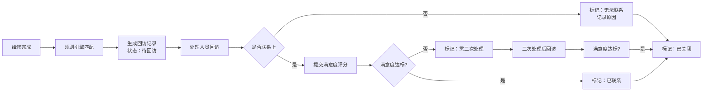
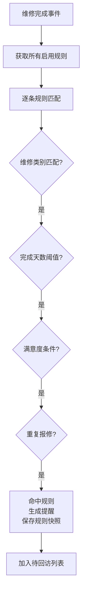

## 1. 产品概述

社区维修回访管理系统是一款用于物业或社区管理部门对维修服务完成后进行回访、满意度调查和问题跟踪的全栈应用。系统通过智能化的回访规则引擎，自动触发提醒，记录用户满意度，帮助管理者持续提升服务质量。

- 核心价值：规范维修服务后续回访流程，量化用户满意度，及时发现和解决未处理问题
- 目标用户：社区管理员、维修处理人员、质量审计人员

## 2. 核心功能

### 2.1 用户角色

| 角色 | 注册方式 | 核心权限 |
|------|----------|----------|
| 管理员 | 系统预设 | 创建和维护维修类别、回访规则、提醒阈值、处理人员账号；查看所有数据 |
| 普通用户（处理人员） | 管理员创建 | 提交回访结果、满意度评分、未解决说明；更新回访状态 |
| 审计员 | 管理员创建 | 查看回访记录、规则命中情况、统计结果；不可修改任何数据 |

### 2.2 功能模块

1. **登录认证**：JWT 令牌登录，角色权限控制
2. **回访列表**：分页展示回访记录，多条件筛选，状态流转
3. **规则配置**：维修类别管理、回访规则配置、提醒阈值设置、处理人员管理
4. **详情轨迹**：单条回访记录完整信息，状态变更历史，操作轨迹
5. **统计看板**：数据可视化图表，关键指标卡片，规则命中排行

### 2.3 页面详情

| 页面名称 | 模块名称 | 功能描述 |
|---------|----------|---------|
| 登录页 | 登录表单 | 用户名密码登录，JWT 认证，错误提示 |
| 回访列表 | 筛选区域 | 按类别、处理人、状态、满意度、日期范围筛选 |
| 回访列表 | 数据表格 | 分页展示，状态标签，快捷操作，跳转详情 |
| 回访列表 | 回访操作 | 提交满意度、状态变更、未解决说明录入 |
| 规则配置 | 维修类别 | 类别增删改查，启用/禁用 |
| 规则配置 | 回访规则 | 规则配置：按维修类别、完成天数、满意度、重复报修触发提醒 |
| 规则配置 | 提醒阈值 | 全局阈值设置，规则优先级配置 |
| 规则配置 | 处理人员 | 账号管理、角色分配、重置密码 |
| 详情轨迹 | 基本信息 | 报修内容、类别、处理人、完成时间 |
| 详情轨迹 | 回访记录 | 回访内容、满意度评分、未解决说明 |
| 详情轨迹 | 状态轨迹 | 状态变更时间线，操作人记录 |
| 详情轨迹 | 规则命中 | 命中的提醒规则及当时的规则说明（历史快照） |
| 统计看板 | 指标卡片 | 待回访数量、二次处理比例、平均满意度 |
| 统计看板 | 图表区域 | 无法联系原因饼图、规则命中排行柱状图 |
| 统计看板 | 交互跳转 | 点击图表或卡片跳转到对应筛选的回访列表 |

## 3. 核心流程

### 3.1 业务主流程

维修工单完成 → 系统根据规则自动生成回访记录 → 处理人员进行回访 → 提交回访结果和满意度 → 根据满意度和规则判断是否需要二次处理 → 关闭或继续跟进

### 3.2 规则命中流程

## 4. 用户界面设计

### 4.1 设计风格

- **主色调**：#1677FF（专业蓝），代表信任和专业
- **辅助色**：#52C41A（成功绿）、#FAAD14（警告橙）、#FF4D4F（危险红）
- **中性色**：#1F2937（深灰）、#6B7280（中灰）、#F3F4F6（浅灰）、#FFFFFF（白）
- **按钮风格**：圆角 6px，轻微阴影，悬停有颜色加深反馈
- **字体**：标题使用 "Noto Sans SC"，正文使用系统无衬线字体
- **布局风格**：左侧导航栏 + 顶部操作栏 + 右侧内容区，卡片式内容分组
- **图标风格**：Ant Design Icons，简洁线性风格

### 4.2 页面设计概述

| 页面名称 | 模块名称 | UI 元素 |
|---------|----------|---------|
| 登录页 | 登录表单 | 居中卡片布局，品牌 Logo，输入框带图标，提交按钮带加载状态 |
| 回访列表 | 筛选区域 | 行内表单布局，下拉选择器，日期范围选择器，重置/查询按钮 |
| 回访列表 | 数据表格 | 斑马条纹行，状态标签色标区分，操作列按钮组，分页器居中 |
| 规则配置 | Tab 切换 | 四个 Tab 页签，卡片表单，动态添加规则条件 |
| 详情轨迹 | 时间线 | 左侧时间线，右侧详情卡片，规则命中高亮显示 |
| 统计看板 | 指标卡片 | 大数字展示，趋势箭头，卡片悬停动效，点击可跳转 |
| 统计看板 | 图表区域 | ECharts 饼图和柱状图，支持数据钻取，图例交互 |

### 4.3 响应式设计

- **设计策略**：桌面端优先，中等屏幕自适应，小屏幕堆叠布局
- **断点设置**：≥1200px 多列布局，992-1199px 自适应缩放，768-991px 简化两列，<768px 单列堆叠
- **触摸优化**：移动端按钮最小尺寸 44px，下拉菜单增加点击区域

## 5. 业务规则说明

### 5.1 状态定义

| 状态 | 说明 |
|------|------|
| 待回访 | 维修完成后系统自动生成，等待处理人员回访 |
| 已联系 | 成功联系用户，满意度达标 |
| 需二次处理 | 用户不满意或问题未解决，需要再次处理 |
| 已关闭 | 回访完成，问题已解决或无需继续跟进 |
| 无法联系 | 多次尝试无法联系到用户，记录原因后关闭 |

### 5.2 回访规则配置项

- **维修类别**：选择适用的维修类别（可多选）
- **完成天数**：维修完成后多少天内触发
- **满意度条件**：≤ N 分触发提醒
- **重复报修**：同一用户 30 天内是否有同类报修
- **规则说明**：命中时展示的提醒文案
- **优先级**：多条规则同时命中时的优先级

### 5.3 规则修改约束

- 规则修改后仅影响新生成的提醒
- 历史提醒保留当时命中的规则说明快照
- 规则删除采用软删除，已命中记录仍可查看原规则
