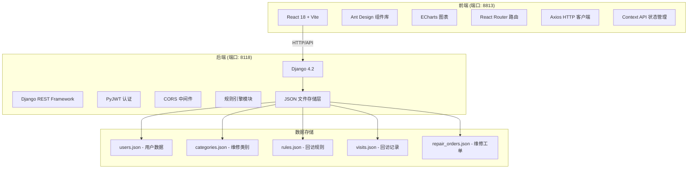
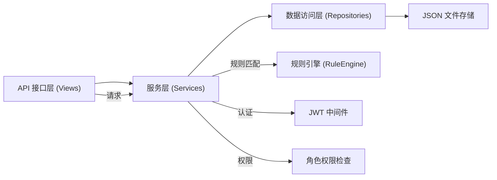
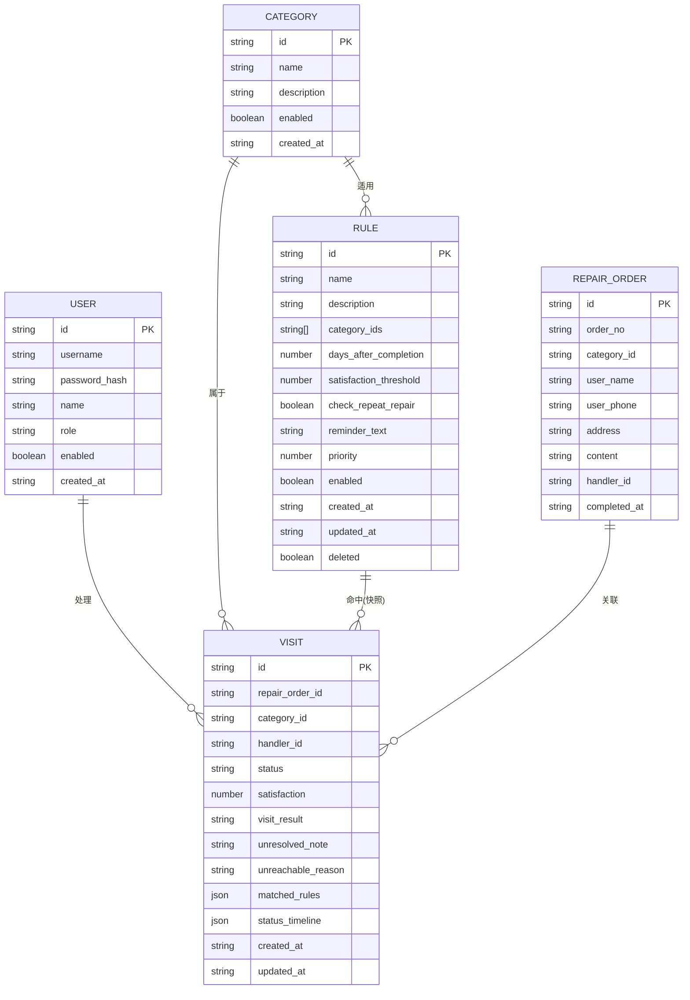

## 1. 架构设计



## 2. 技术描述

- **前端**：React 18 + Vite + React Router 6 + Ant Design 5 + ECharts 5 + Axios
- **前端构建工具**：Vite 5
- **后端**：Django 4.2 + Django REST Framework 3.14 + PyJWT 2.8
- **数据存储**：JSON 文件存储（自定义文件操作层）
- **认证方式**：JWT (JSON Web Token)
- **跨域处理**：django-cors-headers
- **端口配置**：前端 8813，后端 8118

## 3. 前端路由定义

| 路由 | 页面 | 权限角色 | 说明 |
|------|------|----------|------|
| /login | 登录页 | 公开 | JWT 登录表单 |
| / | 统计看板 | 管理员/处理人员/审计员 | 首页，数据可视化 |
| /visits | 回访列表 | 管理员/处理人员/审计员 | 回访记录列表，筛选查询 |
| /visits/:id | 详情轨迹 | 管理员/处理人员/审计员 | 单条回访记录详情和状态轨迹 |
| /rules | 规则配置 | 管理员 | 维修类别、回访规则、提醒阈值、处理人员管理 |
| * | 404 页面 | - | 路由未匹配 |

## 4. 后端 API 定义

### 4.1 认证接口

```typescript
// POST /api/auth/login
interface LoginRequest {
  username: string;
  password: string;
}

interface LoginResponse {
  token: string;
  user: {
    id: string;
    username: string;
    role: 'admin' | 'operator' | 'auditor';
    name: string;
  };
}

// GET /api/auth/me
interface CurrentUserResponse {
  id: string;
  username: string;
  role: 'admin' | 'operator' | 'auditor';
  name: string;
}
```

### 4.2 维修类别接口

```typescript
// GET /api/categories
interface Category {
  id: string;
  name: string;
  description: string;
  enabled: boolean;
  created_at: string;
}

// POST /api/categories (admin only)
// PUT /api/categories/:id (admin only)
// DELETE /api/categories/:id (admin only)
```

### 4.3 回访规则接口

```typescript
// GET /api/rules
interface Rule {
  id: string;
  name: string;
  description: string;
  category_ids: string[];
  days_after_completion: number;
  satisfaction_threshold: number;
  check_repeat_repair: boolean;
  reminder_text: string;
  priority: number;
  enabled: boolean;
  created_at: string;
  updated_at: string;
}

// POST /api/rules (admin only)
// PUT /api/rules/:id (admin only)
// DELETE /api/rules/:id (admin only)
```

### 4.4 回访记录接口

```typescript
// GET /api/visits
interface Visit {
  id: string;
  repair_order_id: string;
  repair_order_no: string;
  category_id: string;
  category_name: string;
  user_name: string;
  user_phone: string;
  address: string;
  repair_content: string;
  handler_id: string;
  handler_name: string;
  completed_at: string;
  status: 'pending' | 'contacted' | 'reprocess' | 'closed' | 'unreachable';
  satisfaction: number | null;
  visit_result: string | null;
  unresolved_note: string | null;
  unreachable_reason: string | null;
  matched_rules: MatchedRuleSnapshot[];
  status_timeline: StatusEvent[];
  created_at: string;
  updated_at: string;
}

interface MatchedRuleSnapshot {
  rule_id: string;
  rule_name: string;
  rule_description: string;
  reminder_text: string;
  matched_at: string;
}

interface StatusEvent {
  status: string;
  operator_id: string;
  operator_name: string;
  remark: string;
  timestamp: string;
}

// 筛选参数
interface VisitFilter {
  category_id?: string;
  handler_id?: string;
  status?: string;
  satisfaction_min?: number;
  satisfaction_max?: number;
  date_from?: string;
  date_to?: string;
  page?: number;
  page_size?: number;
}

// GET /api/visits/:id
// POST /api/visits/:id/process (operator/admin only)
interface ProcessVisitRequest {
  status: 'contacted' | 'reprocess' | 'closed' | 'unreachable';
  satisfaction?: number;
  visit_result?: string;
  unresolved_note?: string;
  unreachable_reason?: string;
  remark?: string;
}
```

### 4.5 用户管理接口（admin only）

```typescript
// GET /api/users
interface User {
  id: string;
  username: string;
  name: string;
  role: 'admin' | 'operator' | 'auditor';
  enabled: boolean;
  created_at: string;
}

// POST /api/users
// PUT /api/users/:id
// DELETE /api/users/:id
// POST /api/users/:id/reset-password
```

### 4.6 统计接口

```typescript
// GET /api/stats/dashboard
interface DashboardStats {
  pending_count: number;
  reprocess_rate: number;
  avg_satisfaction: number;
  total_visits: number;
  unreachable_reasons: { reason: string; count: number }[];
  rule_hit_ranking: { rule_id: string; rule_name: string; hit_count: number }[];
  status_distribution: { status: string; count: number }[];
}
```

## 5. 后端服务架构



## 6. 数据模型

### 6.1 数据模型 ER 图



### 6.2 JSON 文件结构

**users.json**
```json
{
  "users": [
    {
      "id": "uuid",
      "username": "admin",
      "password_hash": "pbkdf2_sha256$...",
      "name": "系统管理员",
      "role": "admin",
      "enabled": true,
      "created_at": "2024-01-01T00:00:00Z"
    }
  ]
}
```

**categories.json**
```json
{
  "categories": [
    {
      "id": "uuid",
      "name": "水电维修",
      "description": "水管、电路相关维修",
      "enabled": true,
      "created_at": "2024-01-01T00:00:00Z"
    }
  ]
}
```

**rules.json**
```json
{
  "rules": [
    {
      "id": "uuid",
      "name": "水电维修3天回访",
      "description": "水电维修完成后3天必须回访",
      "category_ids": ["cat-uuid-1"],
      "days_after_completion": 3,
      "satisfaction_threshold": 3,
      "check_repeat_repair": true,
      "reminder_text": "该维修属于水电类，完成已满3天，请尽快回访确认用户满意度",
      "priority": 1,
      "enabled": true,
      "created_at": "2024-01-01T00:00:00Z",
      "updated_at": "2024-01-01T00:00:00Z",
      "deleted": false
    }
  ]
}
```

**visits.json**
```json
{
  "visits": [
    {
      "id": "uuid",
      "repair_order_id": "order-uuid",
      "repair_order_no": "WX20240101001",
      "category_id": "cat-uuid-1",
      "category_name": "水电维修",
      "user_name": "张三",
      "user_phone": "13800138000",
      "address": "1号楼1单元101",
      "repair_content": "厨房水龙头漏水维修",
      "handler_id": "user-uuid",
      "handler_name": "李师傅",
      "completed_at": "2024-01-01T10:00:00Z",
      "status": "pending",
      "satisfaction": null,
      "visit_result": null,
      "unresolved_note": null,
      "unreachable_reason": null,
      "matched_rules": [
        {
          "rule_id": "rule-uuid",
          "rule_name": "水电维修3天回访",
          "rule_description": "水电维修完成后3天必须回访",
          "reminder_text": "该维修属于水电类，完成已满3天，请尽快回访",
          "matched_at": "2024-01-04T00:00:00Z"
        }
      ],
      "status_timeline": [
        {
          "status": "pending",
          "operator_id": "system",
          "operator_name": "系统",
          "remark": "维修完成，自动生成回访记录",
          "timestamp": "2024-01-01T10:00:00Z"
        }
      ],
      "created_at": "2024-01-01T10:00:00Z",
      "updated_at": "2024-01-01T10:00:00Z"
    }
  ]
}
```

### 6.3 初始化数据

- 默认管理员账号：admin / admin123
- 默认处理人员：operator / operator123
- 默认审计员：auditor / auditor123
- 预置 5 个维修类别：水电维修、家电维修、木工维修、瓦工维修、管道疏通
- 预置 3 条回访规则示例
- 预置 20 条模拟回访记录用于测试
